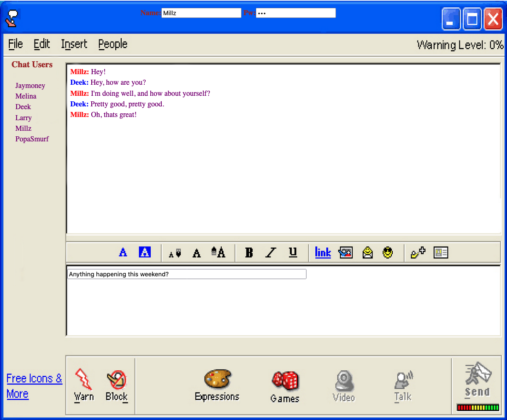

# Web AIM Text Client

This is an in-browser chat application which pays homage to AOL instant messenger. It utilizes a preliminary login function and requires two computers / browsers for full operation. The PHP recognizes when two different chatters are queued and facilitates the connection to provide real time chat functionality.

## Requirements

* HTML/CSS - basis for website and interface
* MySQL - for storing and retrieving chat content
* PHP - for connecting and processing content 
* JavaScript/AJAX - for dynamic refresh and sending 
